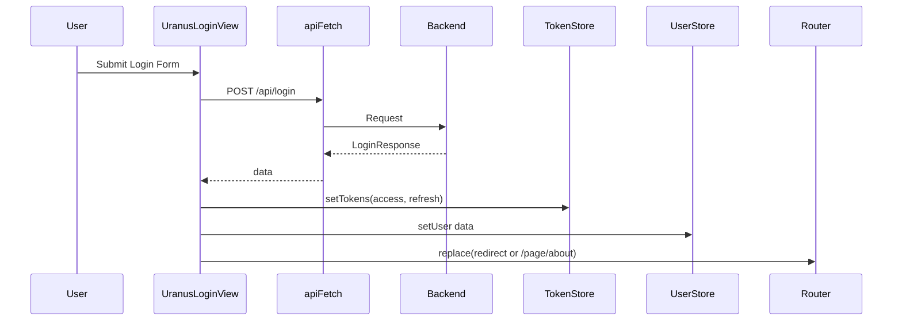
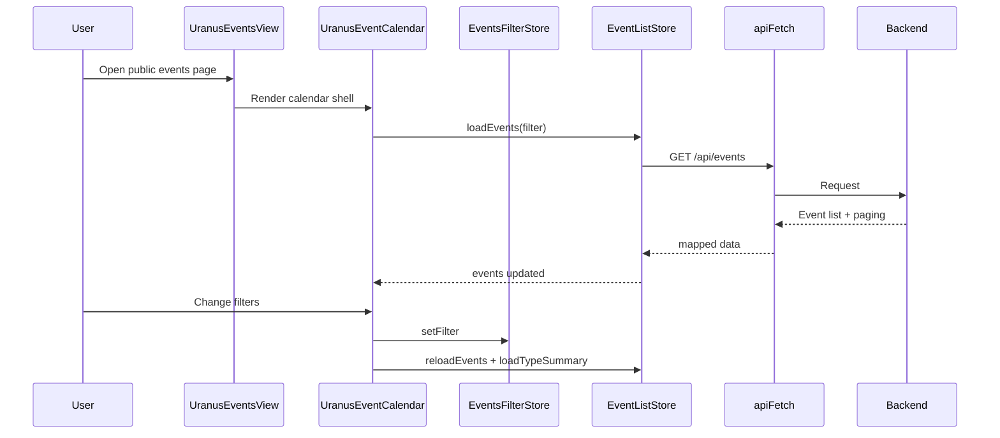
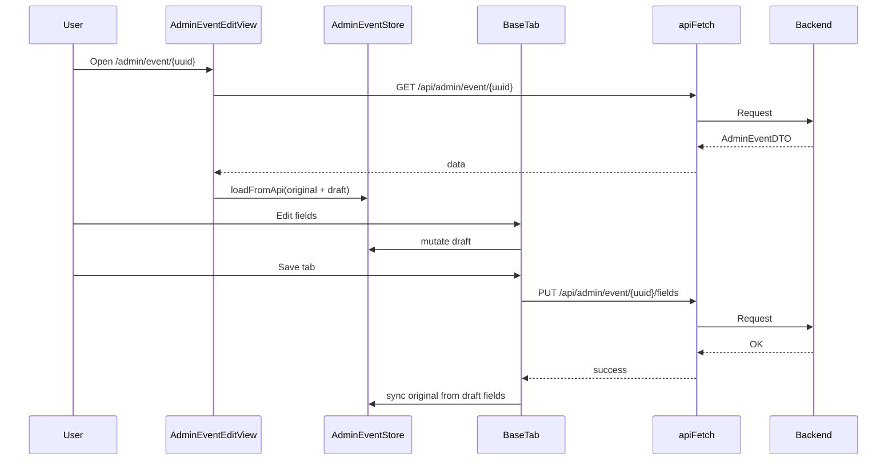
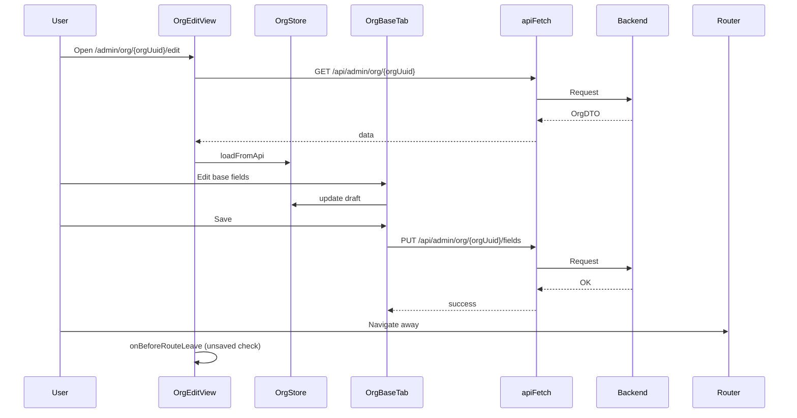
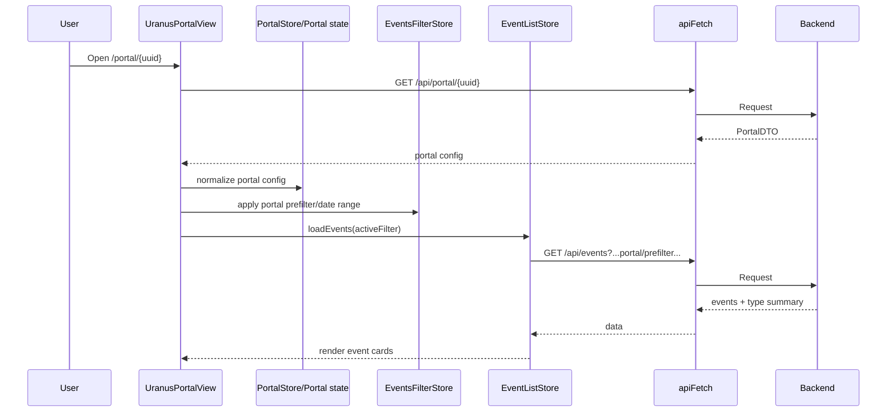

# Frontend Architektur und Datenfluss

Stand: 2026-05-20

Dieses Dokument beschreibt die Frontend-Architektur des Uranus Dashboards entlang der Domänen Event, Org, Venue, Space und Portal.

## 1. Gesamtarchitektur

### 1.1 Schichten

1. Routing und Layout
- Vue Router trennt Public, Admin und Guest-Bereiche.
- Layouts kapseln Header, Sidebar, Content und Footer.

2. Views und Komponenten
- Views orchestrieren Datenladen und Navigation.
- Komponenten kapseln UI und domänenspezifische Bearbeitung (Tabs, Cards, Filter).

3. State Management
- Pinia Stores halten Domain- und UI-State.
- Viele Edit-Flows nutzen Original/Draft-Muster mit Dirty-Tracking.

4. API und Mapping
- apiFetch ist zentraler HTTP-Einstieg mit JWT-Handling und Refresh.
- DTO-zu-Model Mapping trennt Backend-Schema von Frontend-Modellen.

### 1.2 Zentrale Einstiegspunkte

- App Bootstrap: src/main.ts
- Root Rendering: src/App.vue
- Routing: src/router/index.ts
- API Core: src/api.ts

## 2. Domänenskizze je Bereich

## 2.1 Event

### Verantwortung
- Public Event-Liste mit Filtern, Type-Summary, Infinite Scroll.
- Admin Event-Editing in mehreren Tabs.

### Kernbausteine
- Public Listing Store: src/store/eventListStore.ts
- Admin Edit Store: src/store/adminEventStore.ts
- Public Kalender-Orchestrierung: src/component/event/UranusEventCalendar.vue
- Admin Edit-View: src/component/event/view/UranusAdminEventEditView.vue
- Domainmodell: src/domain/event/adminEvent.model.ts

### Schnittstellen
- Inbound UI: Tab-Komponenten expose commitTab und Dirty-Events.
- Outbound API:
  - GET /api/events
  - GET /api/events/type-summary
  - GET /api/admin/event/{uuid}
  - PUT /api/admin/event/{uuid}/fields
- Outbound State: UI aktualisiert Store-Draft, Save schreibt selektive Felder.

## 2.2 Org

### Verantwortung
- Laden und Bearbeiten der Organisation.
- Setzen des aktiven Organisationskontexts.

### Kernbausteine
- Org Store: src/store/orgStore.ts
- Org Domain Mapping: src/domain/org/org.model.ts
- Org Edit-View: src/component/org/view/UranusOrgEditView.vue
- Org Base Save Tab: src/component/org/editor/UranusAdminOrgBaseTab.vue

### Schnittstellen
- Inbound UI: Route-Parameter orgUuid startet Load.
- Outbound API:
  - GET /api/admin/org/{orgUuid}
  - PUT /api/admin/org/{orgUuid}/fields
- Cross-Domain: App-Kontext via src/store/appStore.ts

## 2.3 Venue

### Verantwortung
- Verwaltung von Veranstaltungsorten und Adressdaten.
- Parent-Domäne fuer Space.

### Kernbausteine
- Venue Store: src/store/venueStore.ts
- Venue Domain Mapping: src/domain/venue/venue.model.ts
- Venue Views: src/component/venue/view/*.vue

### Schnittstellen
- Inbound API -> Model: fromApi
- Outbound Model -> API: toVenueDTO
- Routing-Kontext unter /admin/org/:orgUuid/venue/*

## 2.4 Space

### Verantwortung
- Verwaltung von Raeumen innerhalb einer Venue.
- Kapazitaet, Flaeche und Accessibility-Flags (Bitmasken).

### Kernbausteine
- Space Store: src/store/spaceStore.ts
- Space Domain Mapping: src/domain/space/space.model.ts
- Space Views: src/component/space/view/*.vue

### Schnittstellen
- Inbound API -> Model: fromApi
- Outbound Model -> API: toSpaceDTO
- Cross-Domain: venueUuid wird beim Create/Edit als Parent referenziert

## 2.5 Portal

### Verantwortung
- Oeffentliche Portalansicht mit portal-spezifischem Event-Feed.
- Prefilter, Header/Footer, Style, Geometry, optional Custom CSS.

### Kernbausteine
- Portal Store: src/store/portalStore.ts
- Portal Domain Mapping: src/domain/portal/portal.model.ts
- Public Portal View: src/component/portal/view/UranusPortalView.vue
- Admin Portal Tabs: src/component/portal/editor/*.vue

### Schnittstellen
- Inbound API:
  - GET /api/portal/{uuid}
- Outbound API:
  - PUT /api/admin/portal/{uuid}/fields
- Cross-Domain:
  - Portal Prefilter wird in EventListStore Filter eingespeist

## 3. Querschnitt: Auth, Session, Guards

### Auth und Token
- Token-Store verwaltet accessToken, refreshToken und known-account-Status.
- Cross-Tab Logout ueber BroadcastChannel mit localStorage-Fallback.

### API Refresh Flow
- apiFetch behandelt 401 mit zentralem Refresh und Retry.
- Refresh nutzt /api/admin/refresh.

### Route Guards
- requiresAuth leitet auf Login oder Signup um.
- guestOnly blockiert bereits eingeloggte User.

## 4. Sequenzdiagramme der Kern-Flows

## 4.1 Login Flow

## 4.2 Public Event Listing Flow

## 4.3 Admin Event Edit Flow

## 4.4 Org Edit Flow

## 4.5 Portal Render und Prefilter Flow

## 5. Verantwortlichkeitsmatrix (kurz)

| Schicht | Hauptverantwortung | Beispiele |
|---|---|---|
| Router/Layout | Navigation, Guarding, Shell | src/router/index.ts, src/component/layout/*.vue |
| View | Flow-Orchestrierung | src/view/public/UranusEventsView.vue |
| Domain View (Admin) | Editor-Lebenszyklus | src/component/event/view/UranusAdminEventEditView.vue |
| Store | Persistenter und reaktiver Zustand | src/store/*.ts |
| Domain Model | DTO-Entkopplung und Typisierung | src/domain/*/*.model.ts |
| API Core | HTTP, Auth, Error, Retry | src/api.ts |

## 6. Bekannte technische Schwerpunkte

1. Dirty-Tracking ist je Store unterschiedlich implementiert (JSON stringify vs. feldweiser Vergleich).
2. Refresh-Logik ist zentral und kritisch fuer parallele Requests.
3. Portal-Rendering kombiniert API-Daten, Filterstate und CSS-Generierung in einer View.

## 7. Offene Ausbauschritte

1. Einheitliches Edit-Framework fuer Tab-Editoren (Org/Event/Portal).
2. Konsistente Dirty-Strategie pro Domäne.
3. Explizite Architekturtests fuer kritische Datenfluesse (Auth Refresh, Filter Reload, Unsaved-Changes Guard).
